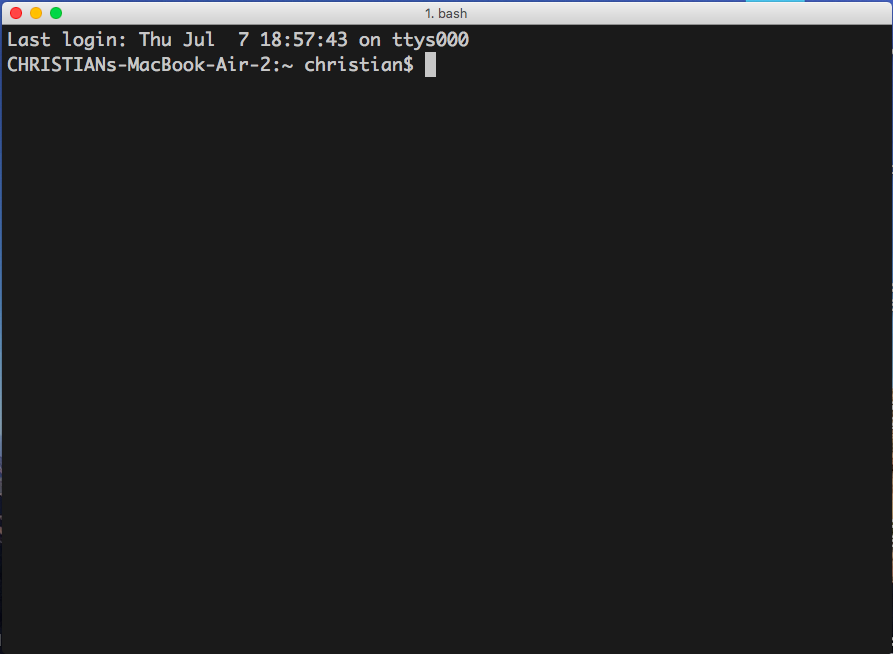

# Introduction to command-line tools

> FIX THE LINKS ONCE EVERYING IS MOVED. THERE ARE LOTS OF BROKEN ONES.

This lesson is a beginner's guide to using command-line tools for coding and data-journalism. It is designed for students who may have never used Terminal before. It is geared toward Macs, but Windows users should be able to follow along if they use Git BASH, which shold be installed with the [git Windows installer](https://git-scm.com/download/).

Some of this lesson is cribbed from the book [The Command Line Crash Course](http://cli.learncodethehardway.org/book/) by Learn Code the Hard Way.

## Macintosh

Oh, you are so lucky. Since Macs are Unix-based, you have everything you need already on your computer to get started with some command-line fun.

Look for a program called **Terminal** on your computer.

It'll look something like this:

## PCs

For the PCs, when you install git for Windows, it also installs  **Git Bash**, which is the terminal program we'll use. Windows is NOT a Unix-based machine like a Mac, so it doesn't naturally understand Unix commands. Git Bash is a program that does.

## Bash

So, Terminal and Git Bash are programs that can run a **shell**, which is the user interface your computer understands. The default language for these interactions is called **Bash**. All these crazy [commands](lectures/Commands.md) I'm going to teach you are BASH commands.

People (including myself) will use the term **shell** to mean "the terminal window you have open". This means when I say "type into your shell", I mean type at the prompt in your terminal window.

When I write out commands for you to type, I will include a `$` at the beginning to indicate this should go at the prompt in your shell. DON'T TYPE IN THE $.

`$ pwd`

That means you type in "pwd" and then hit return.

## Typing vs copy/paste

I encourage you to type commands into your terminal instead of copy and pasting them from the lessons. Build muscle _and_ mind memory. Typing a command wrong and then having to figure out why it broke will help you learn it and remember it. If you just copy and paste blindly, then you won't learn anything other than command-c and command-p.

---
## Lessons

### Learning the terminal

* [Moving around](lectures/bash/moving-around.md)
* [Looking at files](lectures/bash/looking-at-files.md)
* [Bash commands](lectures/bash/bash-commands.md)
* [Bash profiles](lectures/bash/bash-profiles.md)

### Using Git and Bitbucket

* [Git & Bitbucket](lectures/git/gitting-started.md)
* [Sharing code](lectures/git/git-clone.md)
* [Git branches](lectures/git/git-branch.md)

### Python, Jupyter and csvkit

* [Introduction to Anaconda](lectures/python/intro-anaconda.md) (needs rework)
* [Using Jupyter Notbooks](lectures/python/using-jupyter.md) (needs rework)