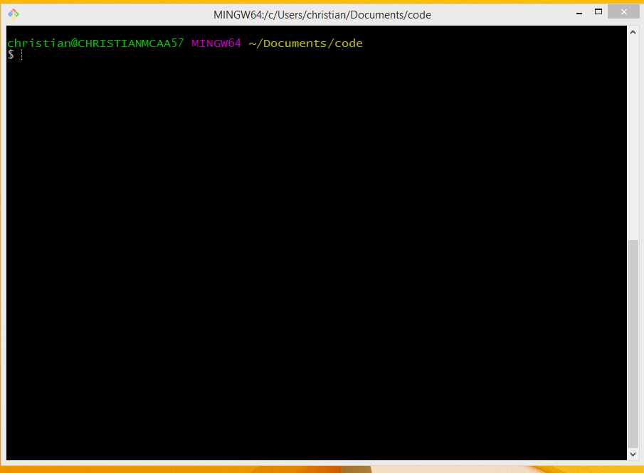

Introduction to command-line tools
==================================

This lesson is a beginner's guide to using command-line tools for data-journalism. It is designed for students who may have never used Terminal before.

Some of this lesson is cribbed from the book [The Command Line Crash Course](http://cli.learncodethehardway.org/book/) by Learn Code the Hard Way.

## Macintosh

Oh, you are so lucky. Since Macs are Unix-based, you have everything you need already on your computer to get started with some command-line fun.

Look for a program called **Terminal** on your computer. (Or, you can download **[iTerm2](https://www.iterm2.com/)**, which is the program I use. For our purposes, it makes no difference.)

It'll look something like this:

## PCs

For the PCs, I need you to download [GitHub for Windows](https://desktop.github.com/). After you do, you'll have a program called **Git Bash**, which is the terminal program we'll use. Windows is NOT a Unix-based machine like a Mac, so it doesn't naturally understand Unix commands. Git Bash is a program that does. (You might find GitHub Desktop useful in the future, too.)

## Bash

So, Terminal and Git Bash are programs that can run a **shell**, which is the user interface your computer understands. The default language for these interactions is called **Bash**. All these crazy [commands](lectures/Commands.md) I'm going to teach you are Bash commands.

Folks (including myself) will use the term **shell** to mean "the terminal window you have open". This means when I say "type into your shell", I mean type at the prompt in your terminal window.

When I write out commands for you to type, I will include a `$` at the beginning to indicate this should go at the prompt in your shell. DON'T TYPE IN THE $.

`$ pwd`

That means you type in "pwd" and then hit return.

---

Next up: [Moving around](lectures/MovingAround.md)
