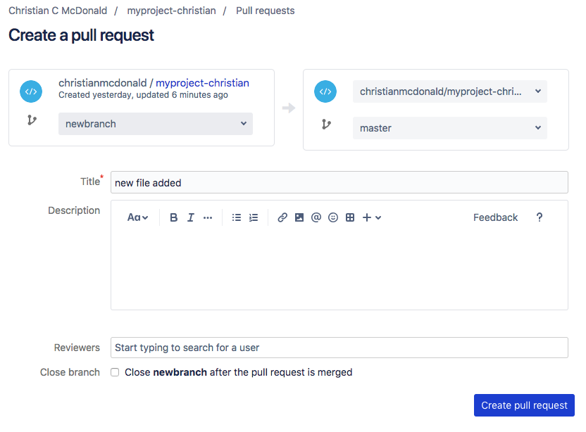

# Git branches and pull requests

One of the features of git is to "branch" code into a copy so you can make changes while the original "master" branch lives on. This is useful in the coding world when you want to add a feature or make changes that don't affect the master yet.

There are different ways to manage this process, including [git flow](https://nvie.com/posts/a-successful-git-branching-model/), [git feature branch flow](https://www.atlassian.com/git/tutorials/comparing-workflows/feature-branch-workflow), [Github flow](https://guides.github.com/introduction/flow/) and probably others. Some systems are more appropriate for different environments, depending on the size of the project and the number of people involved. The most important thing to know is that everyone working on a project should be on the same page, using the same method.

The workflow I typically use is [git feature branch workflow](https://confluence.atlassian.com/bitbucket/workflow-for-git-feature-branching-814201830.html), and I use this even when I'm working solo on a project. Review the link above, but this is typically how it works:

* `master` is the branch in production or ready for production. It should always work.
* Create a **feature branch** to start on new work. Make your changes and push the branch to the repo.
* Create a **pull request** to review changes. This allows you or others to see the changes within Github you are proposing to merge into master. There are functions that allow for official reviews, comments and such. You will also see potential code conflicts.
* Make any changes necesarry and push them to the feature branch.
* Once ready, merge into `master`. All the history of your commits are added to master, and you can safely delete your feature branch on Github and your local machine.

There can be more to it in some shops, like rebasing and squashing, but we won't get into that here.

## Let's do it.

* Go into your "myproject" repo in VS code and open your Integrated Terminal.
* Create your branch: `$ git checkout -b newbranch`.
  * If you have the git-bash-prompt installed, you'll notice the name of the branch has changed in the square brackets.
* Add a new file and call it `newfile.md`. Add a title and some text using proper Markdown syntax.
* Save and add and commit your file, but when you push, you need to change that to `$ git commit origin newbranch` to ensure you are adding to your new branch. (It will give you an error if you try to push to master.
* Go to your repo on Github, and you might notice a yellow box that says a new branch was comitted. You can use the branch dropdown to switch to the new branch and check it out.
* Click on the button **Compare & pull request** to create the new pull request.
  * Here you might name the request and in the comments outline what is being changed, how to test it locally and whatever information your collaborators our your future self might want to know.
* Click the button to create the pull request.



* The pull request allows yourself and collaborators review all your changes, make comments.
* Go ahead and click **Merge pull request** and then **Confirm merge**.

Now the changes you made in `newbranch` are merged into `master` along with all your commit history. Let's clean up all our branches and get back to master.

* Click **Delete branch** to remove `newbranch` from Github.
* Go back to VS Code and into the Integrated Terminal, and switch back to master. `$ git checkout master`. The result is this:

``` bash
15:58 $ git checkout master
Switched to branch 'master'
Your branch is up-to-date with 'origin/master'.
```

You might notice this says you "branch is up-to-date with 'origin/master', and that is confusing, because we know we merged changes that are on Github. This message is referring to your LOCAL branch, not the one on github. We still need to pull in those changes:

`$ git pull origin master`

This will pull the files from Github and bring them local.

You can always check what branches you have locally with `$ git branch`. Try it.

``` bash
16:13 $ git branch
* master
  newbranch
```

We deleted newbranch on Github, but now we can delete it locally with `$ git branch -D newbranch`.

The capitalization of `-D` flag matters.

## Git commands

We used a ton of git commands, and it was only a fraction. It's a complex program. There are tons of cheet sheets out there on the googles, but [this one](https://www.git-tower.com/blog/git-cheat-sheet) is pretty clean.

