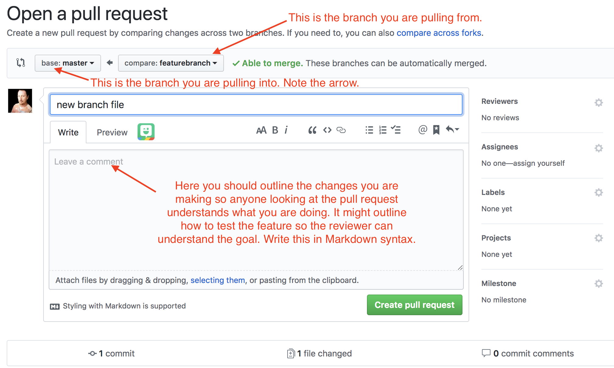
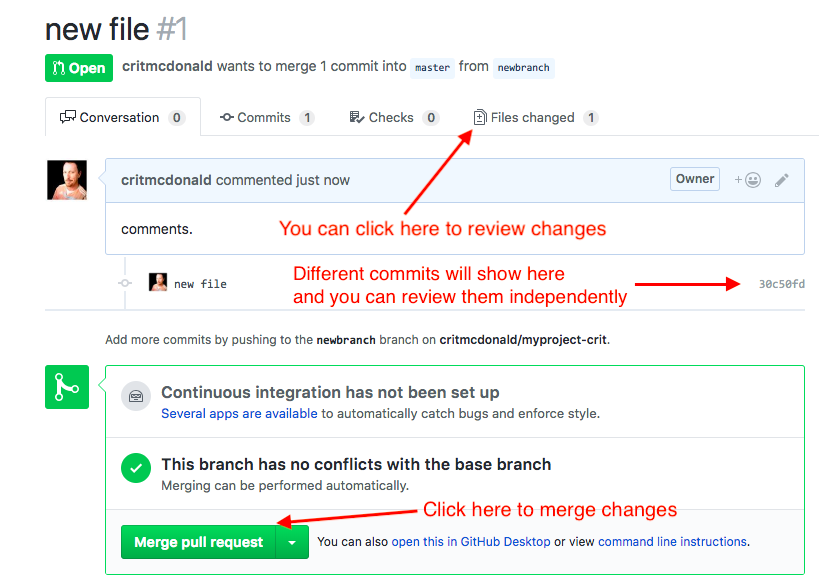

# Git branches and pull requests

One of the features of Git is to "branch" code into a copy so you can make changes while the original "master" branch lives on. This is useful in the coding world when you want to add a feature or make changes that you don't want to yet add to the master.

There are different ways to manage this process, including [git flow](https://nvie.com/posts/a-successful-git-branching-model/), [git feature branch flow](https://www.atlassian.com/git/tutorials/comparing-workflows/feature-branch-workflow), [Github flow](https://guides.github.com/introduction/flow/) and probably others. Some systems are more appropriate for different environments, depending on the size of the project and the number of people involved. The most important thing to know is that everyone working on a project should be on the same page, using the same method.

## Feature branch workflow

The workflow I typically use is [git feature branch workflow](https://confluence.atlassian.com/Github/workflow-for-git-feature-branching-814201830.html), and I use this even when I'm working solo on a project. Review the link above, but this is typically how it works:

* `master` is the branch in production or ready for production. It should always "work" with no bugs.
* Create a **feature branch** to start on new work. Make your changes and push the branch to the repo.
* Create a **pull request** to review changes. This allows you or others to see the changes within Github you are proposing to merge into master. There are tools in Github that allow for official reviews, comments and such. You will also see potential code conflicts.
* Make any changes necessary and push them to the feature branch.
* Once ready, merge into `master`. All the history of your commits are added to master, and your `newbranch` has been deleted on Github.

There can be more to it in some shops, like rebasing and squashing, but we won't get into that here.

## Let's do it

* Go into your "myproject-name" repo in VS code and open your Integrated Terminal.
* Create your branch: `$ git checkout -b newbranch`.
  * If you have the git-bash-prompt installed, you'll notice the name of the branch has changed in the square brackets.
* Add a new file and call it `branchfile.md`. Add a title and some text using proper Markdown syntax.
* Save and add and commit your file, but when you push, you need to change that to `$ git commit origin newbranch` to ensure you are adding to your new branch. (It will give you an error if you try to push to master.) This is the result:

```bash
$ git push origin featurebranch
Enumerating objects: 4, done.
Counting objects: 100% (4/4), done.
Delta compression using up to 8 threads.
Compressing objects: 100% (2/2), done.
Writing objects: 100% (3/3), 354 bytes | 354.00 KiB/s, done.
Total 3 (delta 0), reused 0 (delta 0)
To github.com:critmcdonald/myproject-christian.git
 * [new branch]      featurebranch -> featurebranch
✔ ~/Documents/code/myproject-christian [featurebranch L|✔]
```

* Go to your repo on Github, and you'll notice your `branchfile.md` is not listed. This is because you are looking at your `master` branch.
* You can click on **branches** to see all the branches, or use the **branch dropdown** to switch to your new branch on Github.

## Create a pull request

* Since we just pushed a new branch, you might notice a yellow alert box that has a button where you can **Compare & pull request**. If you have that, go ahead and click on it.
* If you didn't have that, you could click on the **Pull requests** tab at the top, and then choose a **New pull request**.

This is what you get:



You can see from this page that you are merging the branch on the right, `newbranch`, into the branch on the left, which is `master`.

* Here you can give your pull request a title and a description. Your description might outline what is being changed, how to test it locally and whatever information your collaborators our your future self might want to know.
* Click the **Create pull request** button to create the pull request.
* The next screen gives you summary of all the commits that are different from the master. It will list multiple files if there are differences.



* This process also outlines any conflicts there might be between the feature branch and master. You'll have to fix them before you can merge.
* The pull request also allows yourself and collaborators review all your changes and make comments.
* Go ahead and click **Merge pull request** and then **Confirm merge** to merge the branches.

At this point, you can delete the `newbranch` in Github, as indicated with a button. You don't have to since all the commit history is now in master, but it's a good idea to keep everything clean.

Now let's clean up our local repo.

* Go back to VS Code and into the Integrated Terminal, and switch back to master using `git checkout master`. It will look like this:

```bash
$ git checkout master
Switched to branch 'master'
Your branch is up-to-date with 'origin/master'.
(base) ✔ ~/Documents/code/myproject-christian [master|✔]
```

You might notice this says you "branch is up-to-date with 'origin/master', and that is confusing, because we know we merged changes that are on Github. This message is referring to your LOCAL branch, not the one on Github. We still need to pull in those changes:

```
$ git pull origin master
From github.com:critmcdonald/myproject-christian
 * branch            master     -> FETCH_HEAD
Updating b36328f..c85740d
Fast-forward
 branchfile.md | 3 +++
 1 file changed, 3 insertions(+)
 create mode 100644 branchfile.md
✔ ~/Documents/code/myproject-christian [master|✔]
```

This will pull the files from Github and bring them local.

You can always check what branches you have locally with `$ git branch`. Try it.

``` bash
16:13 $ git branch
* master
  newbranch
```

The newbranch on Github went away when we merged it, but now we can delete it locally:

``` bash
$ git branch -D newbranch
Deleted branch newbranch (was 1345054).
✔ ~/Documents/code/myproject-christian [master|✔] 

```

The capitalization of `-D` flag matters.

## Git commands

We used a ton of git commands, and it was only a fraction. It's a complex program. There are tons of cheet sheets out there on the googles, but [this one](https://www.git-tower.com/blog/git-cheat-sheet) is pretty clean.
